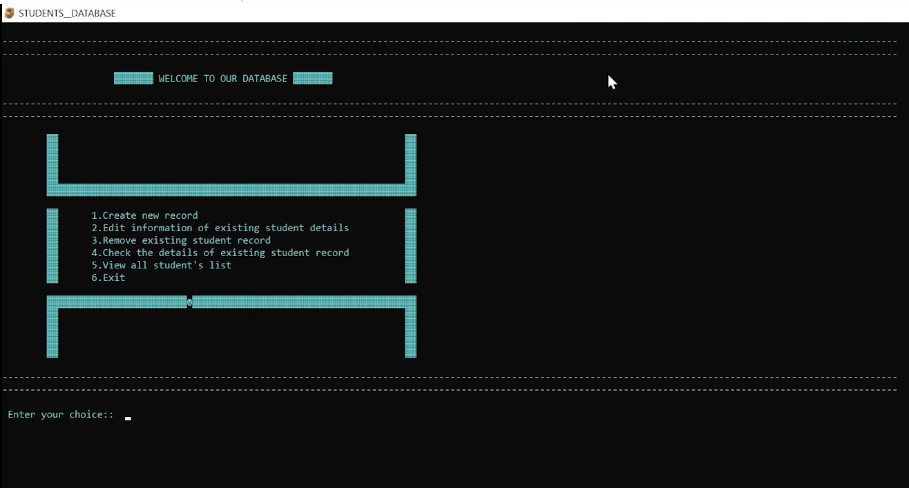
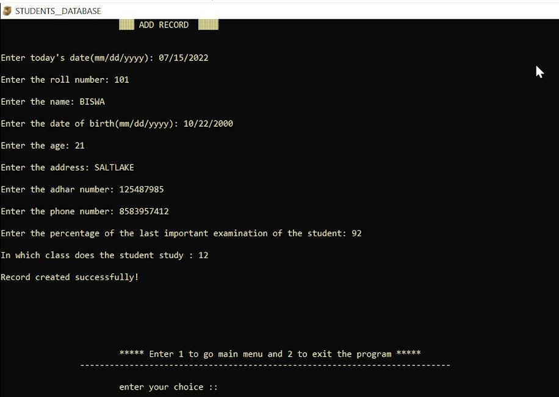
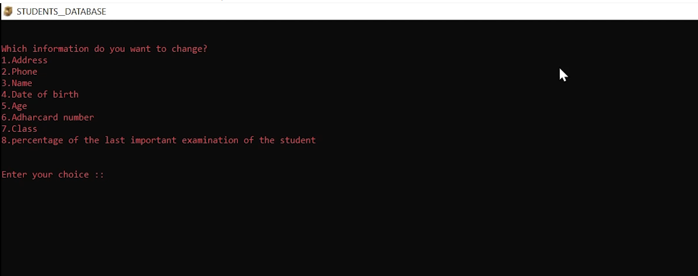
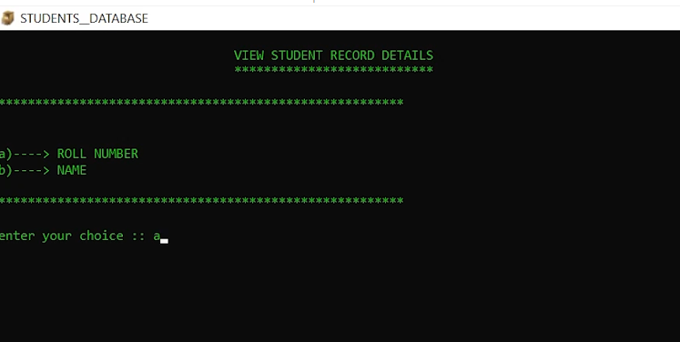
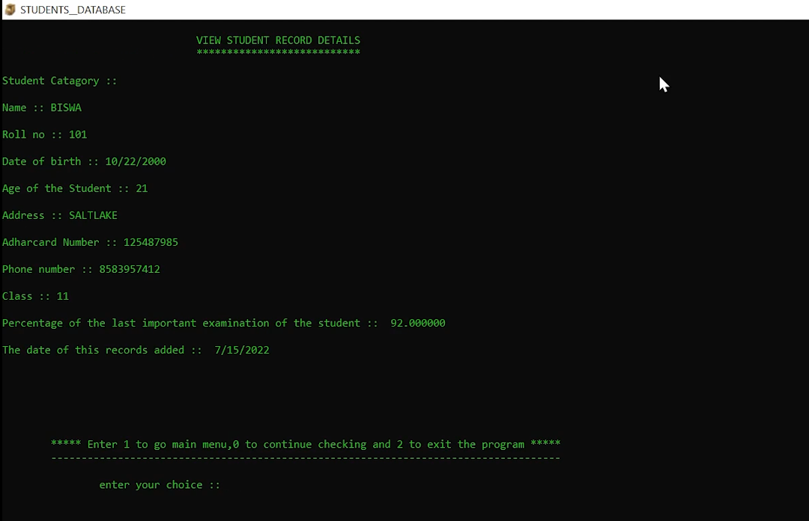
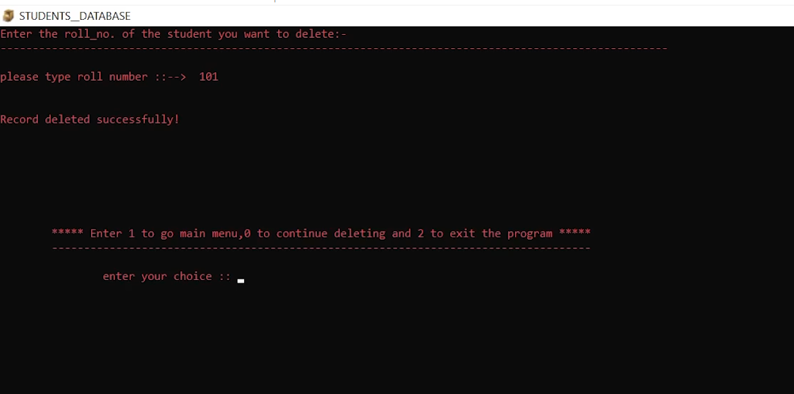
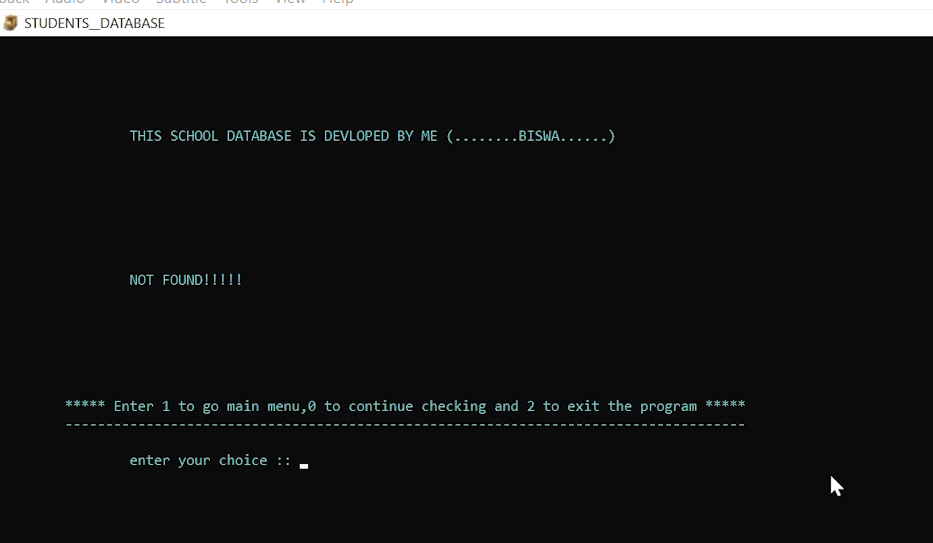

# StudentDatabase-C-PROJECT :star_struck: :open_file_folder: :computer: :closed_book:

[](https://shields.io/) [](https://shields.io/)
<br>

***This new Student Database Management using C is created by Biswarup Bhattacharjee, student of BTECH, in University of Engineering and Management, Kolkata.***

**Email Id: bbiswa471@gmail.com.** 

**Contact No: 916290272740.** 


<p align="left">
<a href="https://www.facebook.com/profile.php?id=100070395300810" target="blank"></a>
<a href="https://instagram.com/biswarup2210" target="blank"></a>
<a href="https://github.com/biswa2210/biswa2210" target="blank"></a>
</p>

## About :point_down: 

<div align="justified">
 
This is a student database management system created using file handling concepts in C. Here we can add record of student, fetch it, delete it. 

</div>

## STUDENT DATABASE MANAGEMENT SYSTEM DEMO VIDEO: :point_right: <a href="https://www.youtube.com/watch?v=kfBfZK9YGXE&list=PL0lbDlMJ1h4g3cSTY44VyQ4Z-5L4kbo2a&index=7">Click here to watch</a>

## C and C++ PLAYLIST: :point_right: <a href="https://www.youtube.com/watch?v=m5VnSust32E&list=PL0lbDlMJ1h4g3cSTY44VyQ4Z-5L4kbo2a">Click here to watch</a>


## Folder Structure :point_down:
```bash
Student Database System
        └── SCHOOL.c
```
    
## Screenshots :point_down: 

<div align="center">

<a href="s1.png"></a>

<a href="s2.png"></a>

<a href="s3.png"></a>

<a href="s4.png"></a>

<a href="s5.png"></a>

<a href="s6.png"></a>

<a href="s7.png"></a>


</div>


